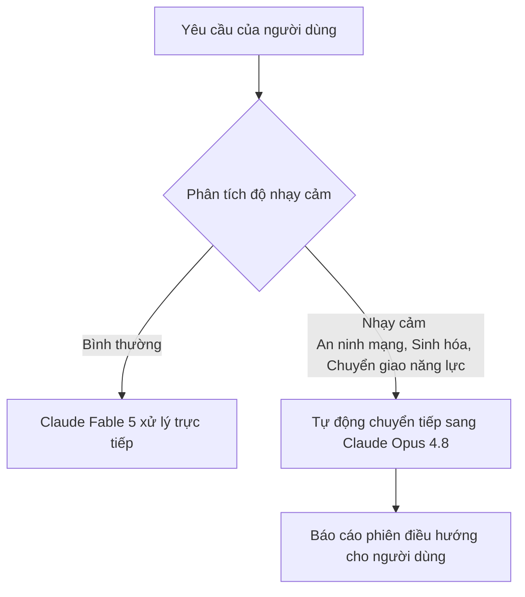

# Hướng dẫn Kỹ thuật: Claude Fable 5 & Claude Mythos 5
*Bản Cập nhật Công nghệ Mới nhất (Tháng 6/2026) từ Anthropic*

---

## 1. Bản chất kiến trúc: Một mô hình, Hai cái tên
Vào tháng 6 năm 2026, Anthropic đã áp dụng một phương thức tiếp cận phát hành sản phẩm hoàn toàn mới: phát hành **cùng một mô hình nền tảng** dưới hai phiên bản tên gọi khác nhau: **Claude Fable 5** và **Claude Mythos 5**.

Sự khác biệt giữa hai phiên bản không nằm ở năng lực tính toán hay trí thông minh cốt lõi, mà nằm ở **hệ thống rào chắn an toàn (safety guardrails)** được thiết lập xung quanh chúng:

* **Claude Fable 5 (Bản Thương mại Rộng rãi):** Được tích hợp đầy đủ hệ thống rào chắn an toàn nghiêm ngặt, mở cửa cho tất cả người dùng cuối và doanh nghiệp.
* **Claude Mythos 5 (Bản Chuyên dụng Hạn chế):** Được gỡ bỏ các rào chắn kiểm duyệt ở một số lĩnh vực nhạy cảm, chỉ cung cấp cho các chuyên gia phòng thủ an ninh mạng và hạ tầng thông tin trọng yếu của chính phủ Hoa Kỳ (thông qua chương trình *Project Glasswing*).

> [!NOTE]
> **Ý nghĩa tên gọi từ Anthropic:**
> * **Fable:** Bắt nguồn từ chữ Latin *fabula* (chuyện kể dân gian) – đại diện cho phiên bản an toàn, thân thiện với số đông.
> * **Mythos:** Có gốc từ chữ Hy Lạp *mythos* (thần thoại sơ khai) – đại diện cho phiên bản đầy đủ quyền năng thô sơ dành cho các chuyên gia nghiên cứu sâu.

### Bảng Mã định danh Model chính thức (Official Model Strings):
Khi gọi API hoặc cấu hình hệ thống, hãy sử dụng các chuỗi định danh chính xác sau:
| Tên mô hình | Model String (API) | Đặc điểm thế hệ |
| :--- | :--- | :--- |
| **Claude Fable 5** | `claude-fable-5` | Trí tuệ tối cao thế hệ 5, có rào chắn bảo vệ |
| **Claude Opus 4.8** | `claude-opus-4-8` | Mô hình suy luận sâu sắc thế hệ 4.8 (bản nâng cấp) |
| **Claude Sonnet 4.6** | `claude-sonnet-4-6` | Mô hình đa năng tốc độ cao thế hệ 4.6 |
| **Claude Haiku 4.5** | `claude-haiku-4-5-20251001` | Mô hình nhỏ, siêu tốc độ thế hệ 4.5 |

---

## 2. Cơ chế Điều hướng An toàn (Safety Fallback Routing)
Một trong những đột phá kỹ thuật lớn nhất được giới thiệu cùng dòng Fable 5 là cơ chế **Điều hướng dự phòng thông minh (Fallback Routing)**. Thay vì từ chối thẳng thừng (Refusal) khi người dùng nhập câu hỏi rơi vào vùng nhạy cảm, Fable 5 sẽ tự động chuyển tiếp yêu cầu xử lý:

### Cách thức hoạt động:
1. Khi phát hiện các chủ đề thuộc nhóm nhạy cảm như an ninh mạng chuyên sâu, hóa học/sinh học nguy hiểm hoặc các truy vấn dạng *distillation* (trích xuất tri thức để huấn luyện mô hình đối thủ), hệ thống sẽ kích hoạt bộ định tuyến.
2. Yêu cầu của người dùng sẽ được chuyển sang **Claude Opus 4.8** (mô hình thế hệ trước với độ an toàn cao hơn).
3. Hơn **95%** các phiên hội thoại hàng ngày của người dùng không chạm đến vùng nhạy cảm này và sẽ chạy trực tiếp trên bộ não nguyên bản của Fable 5.

---

## 3. Hệ sinh thái Tác tử mới (Agentic Ecosystem)
System prompt chính thức của Anthropic hé lộ sự dịch chuyển lớn từ mô hình chat thuần túy sang hệ sinh thái các công cụ tác tác (Agentic Tools) có khả năng chạy lệnh, duyệt web và thao tác tệp tin:

* **Claude Code:** Tác tử lập trình tự động (Agentic Coding Tool) cho phép các nhà phát triển giao việc lập trình trực tiếp từ giao diện dòng lệnh (CLI), ứng dụng máy tính hoặc di động.
* **Claude Cowork:** Ứng dụng desktop tác tử chuyên về các tác vụ tri thức văn phòng (Agentic Knowledge-work Desktop App) dành cho nhân sự phi kỹ thuật, có thể điều phối từ xa qua ứng dụng di động.
* **Các Tác tử Ứng dụng (Beta Agents):**
  * *Claude in Chrome:* Tác tử duyệt web tự động (Browsing Agent).
  * *Claude in Excel:* Tác tử xử lý bảng tính (Spreadsheet Agent).
  * *Claude in Powerpoint:* Tác tử thiết kế slide tự động (Slides Agent).
  *(Claude Cowork có quyền gọi tất cả các tác tử ứng dụng này như những công cụ hỗ trợ)*

---

## 4. Đột phá Năng lực của Thế hệ 5
Fable 5 & Mythos 5 đại diện cho bước nhảy vọt về khả năng tư duy logic và lập trình thực chiến trong các hệ thống codebase quy mô lớn.

### Năng lực Lập trình & Di trú Code (Code Migration)
Trong quá trình thử nghiệm nội bộ với các đối tác lớn như *Stripe*, dòng mô hình thế hệ 5 đã chứng minh khả năng xử lý các tác vụ kỹ thuật phức tạp vốn đòi hỏi nhiều tháng làm việc của con người:
* **Case Study di trú Code:** Thực hiện thành công việc nâng cấp cấu trúc và di trú thư viện trên toàn bộ codebase Ruby quy mô **50 triệu dòng** của Stripe chỉ trong **một ngày**. Tác vụ này thông thường yêu cầu cả một đội ngũ kỹ sư cao cấp làm việc liên tục trong **hai tháng**.
* **Đánh giá benchmark FrontierCode (của Cognition):** Kiểm tra khả năng tự động sửa lỗi, tối ưu hóa và xuất bản mã nguồn đạt chuẩn production. Claude Fable 5 đạt điểm số cao nhất trong số tất cả các mô hình AI tiên phong hiện nay (ngay cả ở mức thiết lập nỗ lực trung bình).

---

## 5. Tác động đối với Prompt Engineering & Thiết kế Skill
Sự xuất hiện của cơ chế tự điều hướng an toàn, quy tắc ứng xử mới và năng lực mạnh mẽ của Fable 5 định hình lại cách chúng ta thiết kế hệ thống tác tử:

1. **Tối ưu hóa Token & Cấu trúc Prompt:** Do Fable 5 có khả năng tự suy luận sâu sắc hơn, các prompt hệ thống không cần phải giải thích quá dài dòng các bước cơ bản. Hãy tập trung vào việc mô tả cấu trúc đầu ra (Output Schema) và bối cảnh nghiệp vụ.
2. **Quy tắc Tránh lạm dụng định dạng (Formatting Cleanliness):**
   * Hạn chế tối đa việc lạm dụng định dạng in đậm, tiêu đề phụ và danh sách gạch đầu dòng (bullet points) trừ khi thật sự cần thiết cho sự rõ ràng. Fable 5 ưu tiên văn xuôi tự nhiên (prose).
   * **Nguyên tắc từ chối lịch thiệp:** Tuyệt đối không dùng danh sách gạch đầu dòng (bullet points) khi từ chối yêu cầu của người dùng để tránh cảm giác cứng nhắc, thay vào đó hãy dùng văn xuôi để tăng sự chân thành và đồng cảm.
3. **Thiết kế Skill thông minh:** Tận dụng tối đa chế độ cô lập `context: fork` của Claude Code để Fable 5 chạy các sub-agent tự động viết, chạy thử và kiểm tra mã nguồn độc lập.
4. **Lưu ý về Fallback:** Nếu xây dựng các Skill liên quan đến bảo mật hoặc viết script hệ thống, hãy chuẩn bị sẵn prompt dự phòng cho trường hợp hệ thống tự điều hướng sang Opus 4.8 để đảm bảo đầu ra vẫn giữ nguyên định dạng cấu trúc cần thiết.
