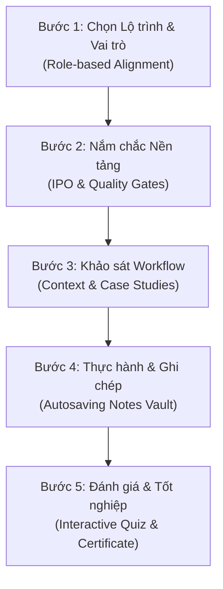

# SỔ TAY HƯỚNG DẪN HỌC TẬP TOÀN DIỆN (COMPREHENSIVE LEARNER HANDBOOK)
**Dự án:** Hệ thống Cây Bài học Tương tác Claude Mastery (55 Poster Thực chiến)  
**Tác giả:** Chuyên gia Thiết kế Trải nghiệm Học tập (LX Director) & Cố vấn Đào tạo Cao cấp  

---

## LỜI MỞ ĐẦU: TRIẾT LÝ HỌC TẬP TÍCH CỰC (ACTIVE LEARNING PHILOSOPHY)
Chào mừng bạn đến với **Sổ tay Hướng dẫn Học tập Toàn diện**. Trong kỷ nguyên AI phát triển vượt bậc, việc học không còn đơn thuần là tích lũy lý thuyết tĩnh, mà là quá trình **hình thành năng lực thực thi tích hợp** (Integrated Execution Capabilities). 

Khóa học này được thiết kế dựa trên 3 trụ cột sư phạm hiện đại:
1. **Giảm thiểu tải nhận thức (Cognitive Load Management):** Chia nhỏ 55 poster tri thức đồ sộ thành 3 Tab quy trình học mạch lạc (Nền tảng -> Ứng dụng -> Thực hành).
2. **Học qua hành động (Action-Oriented Learning):** Mỗi bài học đều có bối cảnh thực tế riêng biệt và đầu ra kỳ vọng cụ thể, loại bỏ hoàn toàn các prompt mẫu sáo rỗng.
3. **Môi trường an toàn (Safeguarding & Quality Gates):** Đưa tư duy an toàn dữ liệu và kiểm chứng thông tin của con người thành chốt chặn bắt buộc trước khi đưa kết quả của AI vào công việc thật.

Sổ tay này sẽ đóng vai trò như một người bạn đồng hành chiến lưu, giúp bạn tối đa hóa hiệu suất học tập, chuyển hóa tri thức thành bộ cẩm nang vận hành (Playbook) của riêng mình.

---

## 🧭 HƯỚNG DẪN QUY TRÌNH HỌC TẬP CHUẨN 5 BƯỚC (5-STEP FRAMEWORK)
Để đạt được trải nghiệm học tập trọn vẹn và tối ưu nhất, mỗi bài học nên được tiếp cận theo chu trình khép kín sau:

### 📍 Bước 1: Đồng bộ hóa lộ trình (Role-based Alignment)
* **Thao tác:** Lọc lộ trình phù hợp nhất với vị trí hiện tại của bạn ở phần đầu trang web (Hành chính nhà nước, Dân văn phòng, Lãnh đạo SME AI-first, hoặc Claude Code).
* **Mục tiêu:** Nhìn rõ sơ đồ cây bài học đã được lọc riêng cho bạn, tự động định vị bài học chưa hoàn thành gần nhất thông qua nút **"Học tiếp"**.

### 📍 Bước 2: Nắm chắc nền tảng & khái niệm (Tab 1)
* **Thao tác:** Đọc kỹ **Mục tiêu**, nghiên cứu sơ đồ **IPO (Input - Process - Output - Outcome)** và rà soát **Khung kiểm soát chất lượng**.
* **Mục tiêu:** Hiểu rõ bài học này đòi hỏi dữ liệu đầu vào gì, AI sẽ xử lý bằng phương pháp nào, sản phẩm kỳ vọng ra sao và năng lực cốt lõi bạn sẽ sở hữu.

### 📍 Bước 3: Thấu hiểu bối cảnh & workflow ứng dụng (Tab 2)
* **Thao tác:** Đọc các Case study thực tế theo lĩnh vực, nhấp chuyển đổi vai trò ở các **Workflow Cards** để cập nhật prompt mẫu và xem quy trình 5 bước áp dụng tương ứng.
* **Mục tiêu:** Kích thích tư duy liên tưởng để chuyển đổi kiến thức trong bài thành giải pháp cho tình huống nghiệp vụ thật của chính bạn.

### 📍 Bước 4: Thực hành thực chiến & Ghi chép (Tab 3)
* **Thao tác:** Copy bộ prompt thực hành đã được cá nhân hóa, đưa vào Claude để chạy thử nghiệm công việc thật. Đồng thời, soạn thảo ghi chú, cải tiến prompt hoặc kết quả tự nghiệm thu vào ô **"Vở ghi chép cá nhân"**.
* **Mục tiêu:** Ghi lại tri thức thực chiến cá nhân hóa. Cơ chế **Autosave** của hệ thống sẽ tự động lưu trữ ghi chú của bạn vào trình duyệt để tạo lập "Bộ não thứ hai" (Second Brain) lâu dài.

### 📍 Bước 5: Tự đánh giá & Vinh danh (Self-Evaluation & Gamification)
* **Thao tác:** Thực hiện bài **Quiz kiểm tra nhanh** trắc nghiệm tương tác để củng cố kiến thức cốt lõi. Sau khi hoàn thành tất cả các bài trong lộ trình, điền tên để hệ thống Canvas tự động sinh và tải xuống **Chứng nhận tốt nghiệp chuyên nghiệp**.
* **Mục tiêu:** Tạo lập thành tựu học tập rõ rệt (Gamification), thúc đẩy động lực hoàn thành lộ trình đào tạo.

---

## 📊 MA TRẬN LỘ TRÌNH ĐÀO TẠO THEO VAI TRÒ (ROLE PATHS MATRIX)

Hệ thống cung cấp 4 lộ trình học tập chuyên biệt giúp người học không bị quá tải thông tin:

| Tên Lộ trình | Số bài học | Đối tượng phù hợp | Giá trị cốt lõi nhận được |
| :--- | :---: | :--- | :--- |
| **1. Hành chính nhà nước** | **25 bài** | Cán bộ công chức, chuyên viên tham mưu, văn thư phòng ban, lãnh đạo phòng. | Tóm tắt/phân luồng hồ sơ, soạn thảo dự thảo văn bản chính xác, thiết lập SOP bảo mật và tuân thủ pháp lý. |
| **2. Dân văn phòng** | **27 bài** | Trợ lý, nhân viên hành chính, marketing, sales admin, nhân sự vận hành. | Tự động hóa xử lý email, biên bản họp thành hành động; tối ưu hóa quy trình làm việc tuần; viết content đa kênh. |
| **3. Lãnh đạo SME AI-first** | **32 bài** | Chủ doanh nghiệp nhỏ và vừa, quản lý vận hành, trưởng nhóm tăng trưởng. | Thiết kế bản đồ ứng dụng AI toàn doanh nghiệp; xây dựng operating playbook; phân tích dữ liệu ra quyết định; đo lường ROI/KPI. |
| **4. Claude Code** | **18 bài** | Lập trình viên, kỹ sư phần mềm, người muốn tự động hóa kỹ thuật sâu. | Quy trình làm việc an toàn với codebase; thiết kế API, database Spec; test case; tối ưu hiệu suất với sub-agent. |

---

## 🛠️ CẨM NANG SỬ DỤNG BỘ CÔNG CỤ AI AGENT TOOLKIT TỐI ƯU
Trong Tab 3 của mỗi bài học, hệ thống tích hợp sẵn **AI Agent Toolkit** gồm 4 prompts mẫu cực kỳ mạnh mẽ để "huấn luyện" Claude đóng vai các trợ lý chuyên biệt:

### 1. Trợ lý học bài (AI Tutor Agent)
* **Khi nào cần dùng:** Khi bạn muốn hiểu sâu một khái niệm khó hoặc muốn có một người kèm cặp học tập 1-1.
* **Cách dùng:** Copy prompt, dán vào Claude. AI sẽ tự động giải thích khái niệm theo 3 cấp độ (dễ hiểu, thực chiến, chuyên sâu), hỏi bối cảnh của bạn để dẫn dắt bạn thực hành từng bước.

### 2. Trợ lý làm việc (Workflow Designer Agent)
* **Khi nào cần dùng:** Khi bạn muốn số hóa hoặc tối ưu hóa một tác vụ thủ công trong phòng ban thành quy trình AI-first.
* **Cách dùng:** Chạy prompt và điền mô tả công việc thật của bạn. AI sẽ phác thảo bản đồ quy trình trước/sau, chỉ định điểm dùng AI, viết prompt mẫu và lập kế hoạch pilot trong 7 ngày.

### 3. Trợ lý lập trình (Coding Agent)
* **Khi nào cần dùng:** Khi làm việc với các dự án code, script tự động hóa hoặc tích hợp hệ thống.
* **Cách dùng:** Thích hợp dùng làm chỉ dẫn hệ thống cho Claude Code hoặc các IDE Coding Agent. Giúp định hình phong cách làm việc kỷ luật: khảo sát codebase trước, viết spec, sửa lỗi biên và chạy test case cẩn trọng.

### 4. Trợ lý kiểm tra & Đánh giá (Reviewer Agent)
* **Khi nào cần dùng:** Chốt chặn cuối cùng trước khi gửi kết quả của AI cho đối tác, khách hàng hoặc lãnh đạo cấp trên.
* **Cách dùng:** Dán sản phẩm AI đã tạo ra kèm prompt. AI sẽ đóng vai chuyên gia phản biện để bắt lỗi mơ hồ, số liệu không căn cứ, rủi ro bảo mật dữ liệu và viết lại phiên bản tốt hơn.

---

## ⚠️ NGUYÊN TẮC KIỂM SOÁT CHẤT LƯỢNG & AN TOÀN DỮ LIỆU (QUALITY GATES)
Bảo mật thông tin và tính chính xác là ranh giới sống còn khi đưa AI vào môi trường chuyên nghiệp. Học viên bắt buộc phải ghi nhớ nguyên tắc **"4 Lớp Chốt chặn"**:

1. **Lớp Ẩn danh (Anonymization Gate):** Tuyệt đối không đưa thông tin cá nhân (số định danh, điện thoại, địa chỉ), tài liệu mật của cơ quan, bí mật công nghệ hoặc thông tin tài chính chưa được phép công khai lên AI. Luôn thay thế bằng dữ liệu giả lập hoặc ẩn danh trước khi chạy prompt.
2. **Lớp Kiểm chứng (Verification Gate):** AI có thể tạo ra các ảo giác logic, bịa số liệu hoặc văn bản pháp lý. Con người bắt buộc phải tra cứu, đối chiếu lại số liệu thực tế, văn bản quy phạm pháp luật và các mốc deadline.
3. **Lớp Thẩm quyền (Authority Gate):** Kết quả do AI tạo ra chỉ đóng vai trò **bản nháp hỗ trợ**. Quyết định ban hành, phê duyệt và chịu trách nhiệm pháp lý cao nhất luôn thuộc về con người.
4. **Lớp Cải tiến (Optimization Gate):** Không copy nguyên bản kết quả đầu tiên của AI. Hãy luôn rà soát giọng văn, bổ sung căn cứ thực tế của đơn vị để biến sản phẩm thành phiên bản chất lượng cao nhất.

---

## 🧠 CHIẾN LƯỢC BIẾN GHI CHÚ TRÊN WEB THÀNH BỘ NÃO THỨ HAI (SECOND BRAIN)
Hệ thống **My Personal Notes Vault** không chỉ là một ô nhập văn bản đơn thuần, mà là công cụ tích lũy tri thức số hóa lâu dài:
* **Ghi chép prompt cải tiến:** Mỗi khi bạn tối ưu thành công một prompt cho công việc thật từ bài học, hãy dán prompt tốt nhất đó vào Vở ghi chép.
* **Tích lũy SOP cá nhân:** Ghi lại các lưu ý nghiệp vụ hoặc lỗi thường gặp khi triển khai tác vụ đó tại đơn vị của bạn.
* **Đồng bộ hóa tri thức:** Dữ liệu ghi chép được lưu trữ ngay trong trình duyệt của bạn. Bạn có thể mở lại bất cứ lúc nào để tra cứu nhanh khi cần thực thi công việc hằng ngày, tạo thành một thư viện prompt và cẩm nang vận hành cá nhân hóa tuyệt đối.

---
> [!IMPORTANT]
> **HÃY BẮT ĐẦU VỚI TƯ DUY CHỦ ĐỘNG:**  
> AI không thay thế công việc của bạn, nhưng người biết sử dụng AI chuyên nghiệp và an toàn sẽ thay thế những người không dùng AI. Chúc bạn có một hành trình học tập xuất sắc và gặt hái được nhiều thành tựu vượt trội với **Claude Mastery**!
